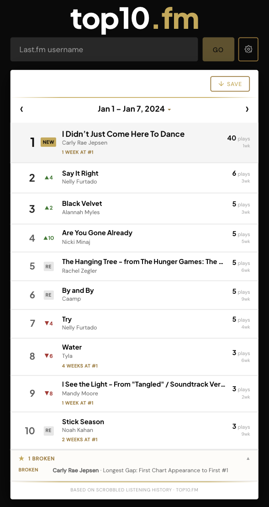
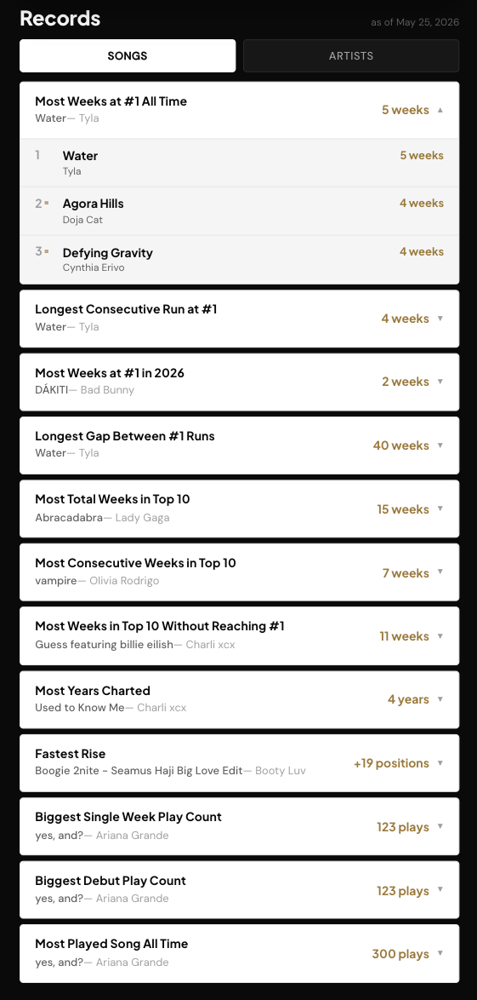

# top10.fm

Weekly personal music charts built from your Last.fm scrobble history. Every Monday, your listening data is ranked by play count, tracked over time, and presented in a Billboard-style top 10 with movement indicators, peak positions, and a records engine tracking 30 personal listening milestones.

**[Live Demo →](https://top10-fm.vercel.app)**



---

## How It Works

```
Last.fm API → Parallel scrobble fetch → Weekly chart computation
           → Records engine (30 records × top 3 holders)
           → DynamoDB (chart + snapshot per week)
           → React frontend (navigation, records, export)
```

A new user enters their Last.fm username. The backend fetches their complete scrobble history week by week, computes every chart in a single forward pass, and stores the results. On return visits, only new weeks since the last visit are computed. Navigation between weeks is a single DynamoDB read.

---

## Features

- Weekly top 10 charts with movement (▲▼—), peak position, and weeks on chart
- Full chart history navigation via prev/next or calendar picker
- 30 personal records tracked across songs and artists — most weeks at #1, longest consecutive run, biggest debut, fastest rise, and more — each with a top 3 leaderboard
- Records broken bar showing which records changed in a given week
- Chart export as image — download on desktop, hold-to-save modal on mobile
- Past Records view showing records as they stood at any historical week



---

## Architecture

```
                    ┌─────────────────────────────────┐
                    │         API Gateway              │
                    └──────┬──────────────────┬────────┘
                           │                  │
                    ┌──────▼──────┐   ┌───────▼───────┐
                    │  /validate  │   │   /backfill    │
                    │   Lambda    │   │    Lambda      │
                    └─────────────┘   └───────┬───────┘
                                              │ async invoke
                                      ┌───────▼───────┐
                                      │ backfill_worker│
                                      │    Lambda      │
                                      └───────┬───────┘
                                              │
                                      ┌───────▼───────┐
                                      │   DynamoDB     │
                                      │ users / charts │
                                      │ / records      │
                                      └───────────────┘
```

Six Lambda functions handle distinct responsibilities:

| Function | Trigger | Responsibility |
|---|---|---|
| `validate` | GET | Checks Last.fm username, returns system status |
| `backfill` | POST | Marks user as in-progress, async-invokes backfill_worker |
| `backfill_worker` | Async event | Full history fetch, chart compute, DynamoDB write |
| `get_chart` | GET | Returns chart + navigation for a given week |
| `get_records` | GET | Returns records snapshot for a given week |
| `weekly_update` | GET | Computes new weeks for returning users |

---

## Engineering

top10.fm is serverless using Lambda + API Gateway with DynamoDB for storage. This scales to zero cost at low traffic and eliminates server management entirely. The core design decision is to store fully computed weekly charts rather than raw scrobbles. Last.fm already stores the raw data; there's no reason to duplicate it. Every chart row in DynamoDB contains pre-enriched entries with movement, peak position, and streak metadata, so any read is instant regardless of how long a user's history is.

The records engine follows the same principle. 30 records are tracked across songs and artists, each with a top 3 leaderboard. A naive approach would recompute all records from scratch on every week navigation which is O(n²) across history. Instead, backfill runs a single forward pass in O(n) time, updating a running state accumulator week by week. The full records snapshot at every week is stored directly on that week's chart row in DynamoDB. Reading records for any past week — current or historical — is a single `GetItem` call.

The challenge this design had to absorb was users with very long histories. Sequential week-by-week fetching from the Last.fm API — one call per week — took 13 minutes for a 456-week user with 194k scrobbles, leaving almost no time for chart computation, records processing, and 456 DynamoDB writes before Lambda's hard 15-minute limit killed the process. The fix was `ThreadPoolExecutor(max_workers=4)`, which parallelizes the fetch across 4 threads and cuts that phase from 13 minutes to 3.5 minutes — a 73% reduction. Thread results are keyed by week index and reassembled in chronological order before the chart pipeline runs, preserving the ordered dependency chain that movement and peak calculations require. Total backfill for 456 weeks now completes in 7.5 minutes. A 500-week hard cap handles anything beyond that, with a user-facing message rather than a silent timeout.

---

## Stack

**Frontend:** React · TypeScript · html2canvas · date-fns · Vercel  
**Backend:** Python · AWS Lambda · API Gateway · DynamoDB · SAM  
**External:** Last.fm API